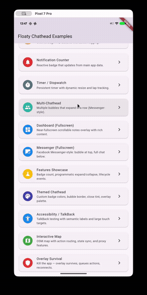
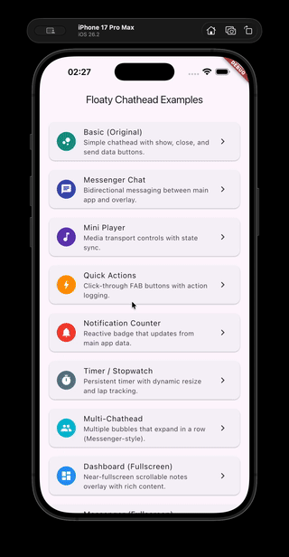

# Floaty Chatheads

[![style: very good analysis][very_good_analysis_badge]][very_good_analysis_link]
[![License: MIT][license_badge]][license_link]
[![coverage: 100%][coverage_badge]][coverage_link]
[![tests: 267 passed][tests_badge]][tests_link]

**Floating bubble overlays for Flutter -- like Facebook Messenger chatheads, but for any widget.**

Ever used Facebook Messenger on Android and seen that little circular bubble
floating on top of everything? That is a "chathead." This plugin lets you build
the same thing in Flutter -- a draggable bubble that floats above your app (or
even above *other* apps on Android) and expands into any Flutter widget you want:
a mini player, a chat window, quick-action buttons, a dashboard, or anything
else you can dream up.

<table>
  <tr>
    <th>Android</th>
    <th>Android</th>
    <th>iOS</th>
  </tr>
  <tr>
    <td>
      
    </td>
    <td>
      
    </td>
    <td>
      
    </td>
  </tr>
</table>

---

## Why Floaty Chatheads?

| What you get | Why it matters |
|---|---|
| **One API, two platforms** | Write your overlay once -- it works on Android *and* iOS with the same Dart code |
| **Any Flutter widget** | The expanded panel is a full Flutter engine, so you can use any widget, package, or animation |
| **Spring-physics drag** | The bubble snaps to screen edges with smooth, natural-feeling spring animations |
| **Survives app death (Android)** | Your overlay stays alive even if the user kills the main app |
| **Zero-boilerplate helpers** | Show a chathead in 3 lines; build an overlay widget in 1 line |
| **Built-in messaging** | Send data back and forth between your main app and the overlay in real time |
| **Theming & accessibility** | Full TalkBack / VoiceOver support, customizable colors, and a debug inspector |
| **Production-ready** | 267 tests, 100% coverage on handwritten code, MIT licensed |

---

## How It Works (the big picture)

```
 Your Main App                              Floating Overlay
 ─────────────                              ────────────────
 ┌──────────────────┐                       ┌──────────┐
 │                  │   showChatHead()       │  Bubble  │ ← draggable, snaps
 │  FloatyChatheads ├──────────────────────► │  (icon)  │   to screen edges
 │                  │                        └────┬─────┘
 │  shareData({})  ◄──── bidirectional ────►      │ tap
 │  onData.listen() │    messaging                ▼
 │                  │                        ┌──────────┐
 └──────────────────┘                       │  Content  │ ← any Flutter widget
                                            │  Panel    │   you define
                                            └──────────┘
```

1. **You call `showChatHead()`** from your main app. This launches a floating
   bubble on the screen.
2. **The bubble is draggable.** Users can drag it around; it snaps to screen
   edges with spring physics.
3. **Tapping the bubble expands a content panel** -- this is a completely
   separate Flutter widget running in its own engine (think of it as a
   mini-app inside the overlay).
4. **Your main app and the overlay can talk to each other** using
   `shareData()` / `onData` streams, or the higher-level helpers like
   `FloatyStateChannel`, `FloatyActionRouter`, and `FloatyProxyClient`.
5. **Dragging the bubble to the close target** (bottom of the screen) dismisses
   the overlay.

> **Key concept -- separate engine:** The overlay runs in its own Flutter
> engine, not inside your app's widget tree. This means it has its own
> `main()` function (called an "entry point") and its own state. The plugin
> handles all the wiring between the two engines for you.

---

## Quick Start (5 minutes)

### 1. Install

```yaml
dependencies:
  floaty_chatheads: ^1.2.1
```

```bash
flutter pub get
```

**Requirements:** Dart `^3.4.0`, Flutter `>=3.22.0`, Android 6.0+ (API 23) / iOS 13.0+

### 2. Platform setup

**Android** -- add these permissions to `android/app/src/main/AndroidManifest.xml`
(inside the `<manifest>` tag, before `<application>`):

```xml
<uses-permission android:name="android.permission.SYSTEM_ALERT_WINDOW" />
<uses-permission android:name="android.permission.FOREGROUND_SERVICE" />
<uses-permission android:name="android.permission.FOREGROUND_SERVICE_SPECIAL_USE" />
<uses-permission android:name="android.permission.WAKE_LOCK" />
```

**iOS** -- nothing to do! No permissions needed.

### 3. Add your bubble icon to assets

Put an image (e.g. `chatheadIcon.png`) in your `assets/` folder and declare it
in `pubspec.yaml`:

```yaml
flutter:
  assets:
    - assets/chatheadIcon.png
    - assets/close.png        # optional close-target icon (Android)
    - assets/closeBg.png      # optional close-target background (Android)
```

> **iOS note:** Icon assets are optional on iOS because the overlay is rendered
> entirely by your Flutter widget. On Android they are used for the native
> bubble bitmap and close-target drawable.

### 4. Create the overlay widget

The overlay runs in its own Flutter engine, so it needs a **top-level function**
marked with `@pragma('vm:entry-point')`. The easiest way is the one-liner helper:

```dart
// file: lib/overlay_main.dart

import 'package:floaty_chatheads/floaty_chatheads.dart';
import 'package:flutter/material.dart';

@pragma('vm:entry-point')
void overlayMain() => FloatyOverlayApp.run(
  const Center(
    child: Material(
      elevation: 8,
      borderRadius: BorderRadius.all(Radius.circular(16)),
      child: Padding(
        padding: EdgeInsets.all(24),
        child: Text('Hello from the overlay!'),
      ),
    ),
  ),
);
```

`FloatyOverlayApp.run()` takes care of `WidgetsFlutterBinding`, wraps your
widget in a `MaterialApp`, and calls `FloatyOverlay.setUp()` so messaging works
out of the box.

### 5. Show the chathead

```dart
import 'package:floaty_chatheads/floaty_chatheads.dart';

Future<void> launchChatHead() async {
  // 1. Ask for permission (no-op on iOS).
  final granted = await FloatyChatheads.checkPermission();
  if (!granted) await FloatyChatheads.requestPermission();

  // 2. Show the chathead!
  await FloatyChatheads.showChatHead(
    entryPoint: 'overlayMain',           // must match the function name above
    assets: const ChatHeadAssets(
      icon: IconSource.asset('assets/chatheadIcon.png'),
      closeIcon: IconSource.asset('assets/close.png'),
      closeBackground: IconSource.asset('assets/closeBg.png'),
    ),
    notification: const NotificationConfig(title: 'My Chathead'),
    sizePreset: ContentSizePreset.card,  // 300×400 dp content panel
  );
}
```

That is it! Run `flutter run`, call `launchChatHead()`, and you will see a
floating bubble on the screen.

### 6. Send data between app and overlay

```dart
// In your main app -- send data to the overlay:
FloatyChatheads.shareData({'message': 'Hello overlay!'});

// In your main app -- listen for data from the overlay:
FloatyChatheads.onData.listen((data) {
  print('Overlay said: $data');
});
```

```dart
// In the overlay widget -- send data to the main app:
FloatyOverlay.shareData({'action': 'button_pressed'});

// In the overlay widget -- listen for data from the main app:
FloatyOverlay.onData.listen((data) {
  print('Main app said: $data');
});
```

---

## Choose Your Level

Floaty Chatheads is designed so you can start simple and add complexity only
when you need it. Here is a roadmap:

| Level | What to use | Good for |
|---|---|---|
| **Beginner** | `showChatHead()` + `shareData()` / `onData` | Simple overlays, quick prototypes |
| **Intermediate** | `FloatyOverlayApp.run()`, `FloatyScope`, `FloatyLauncher`, `FloatyController` | Less boilerplate, lifecycle management |
| **Advanced** | `FloatyStateChannel`, `FloatyActionRouter`, `FloatyProxyHost/Client`, `FloatyHostKit` | Complex state sync, RPC, offline queueing |

All levels use the same underlying plugin -- the helpers just reduce boilerplate.

---

## Platform Comparison

The plugin exposes a **single Dart API** for both platforms, but the underlying
implementations differ due to OS-level constraints:

| Capability | Android | iOS |
|---|---|---|
| **Overlay scope** | System-wide (above all apps) | App-level (above your app only) |
| **Permissions** | `SYSTEM_ALERT_WINDOW` required | None required |
| **Bubble rendering** | Native `View` with bitmap icon | Flutter widget |
| **Edge snapping** | Spring physics with configurable margin | Spring physics with configurable margin |
| **Entrance animations** | Pop, slide, fade | Pop, slide, fade |
| **Badge counter** | Native drawn badge | Native drawn badge |
| **Theming** | Badge, border, shadow, close tint, palette | Badge, border, shadow, palette |
| **Size presets** | `compact`, `card`, `halfScreen`, `fullScreen` | `compact`, `card`, `halfScreen`, `fullScreen` |
| **Debug inspector** | FPS, spring HUD, bounds, message log | `getDebugInfo()` |
| **Accessibility** | Full TalkBack support | VoiceOver labels and screen changes |
| **Dragging** | Spring physics touch handler | `UIPanGestureRecognizer` |
| **Position persistence** | Supported | Supported (`UserDefaults`) |
| **Foreground service** | Persists across app switches | N/A (app-level window) |
| **Overlay survival** | Survives app death (service-owned engine) | N/A |
| **Bidirectional messaging** | Yes | Yes |
| **Multi-bubble** | Messenger-style row | Via Flutter API callback |
| **Min platform version** | Android 6.0+ (API 23) | iOS 13.0+ |

> **Note:** On iOS, `checkPermission()` and `requestPermission()` always return
> `true` since no special permission is needed.

---

## Features at a Glance

| Category | What it does |
|---|---|
| **Chathead Bubbles** | Draggable bubble with spring-based edge snapping, entrance animations (pop, slide, fade), and multi-bubble support (Messenger-style row) |
| **Content Panel** | Any Flutter widget rendered in a separate engine -- like a mini-app inside the overlay |
| **Bidirectional Messaging** | `shareData` / `onData` streams for real-time two-way communication |
| **Badge Counter** | Numeric badge on the bubble, updatable from either side |
| **Theming** | Badge colors, bubble border, shadow, close-target tint, and a full color palette forwarded to the overlay |
| **Size Presets** | Named sizes (`compact`, `card`, `halfScreen`, `fullScreen`) instead of raw pixel values |
| **Debug Inspector** | Native overlay with FPS counter, spring HUD, view bounds, and Pigeon message log (Android) |
| **Optional Logging** | All native logcat output is silent by default; set `debugMode: true` to enable verbose logs during development |
| **Accessibility** | TalkBack (Android) and VoiceOver (iOS) with content descriptions, live-region announcements, and focus management |
| **Lifecycle Events** | Streams for `onTapped`, `onClosed`, `onExpanded`, `onCollapsed`, `onDragStart`, `onDragEnd` |
| **Permission Gate** | `FloatyPermissionGate` widget that shows a fallback until overlay permission is granted |
| **Programmatic Control** | `expandChatHead()`, `collapseChatHead()`, `addChatHead()`, `removeChatHead()`, `resizeContent()` |
| **Foreground Service** | Overlay persists across app switches (Android) |
| **Overlay Survival** | Overlay survives app death -- service-owned engine, connection detection, action queueing, proxy RPC, and automatic reconnection (Android) |
| **State Channel** | `FloatyStateChannel<T>` for type-safe bidirectional state sync with JSON serialization |
| **Action Routing** | `FloatyActionRouter` for typed action dispatch with handler registration and offline queueing |
| **Proxy Services** | `FloatyProxyHost` + `FloatyProxyClient` for request/response RPC between main app and overlay |

---

## Convenience Helpers

The plugin ships helpers at different levels of abstraction. Pick the one that
fits your use case -- you can always switch later.

| Need | Use | Complexity |
|---|---|---|
| Bootstrap an overlay entry point | `FloatyOverlayApp.run()` / `.runScoped()` | Beginner |
| Launch with auto permission handling | `FloatyLauncher` | Beginner |
| Lifecycle-aware show/close tied to a widget | `FloatyControllerWidget` / `FloatyController` | Beginner |
| Auto-wired overlay context with all streams | `FloatyScope` / `FloatyOverlayScope` | Intermediate |
| Display incoming overlay data reactively (main app) | `FloatyDataBuilder<T>` | Intermediate |
| Build an overlay with zero lifecycle code | `FloatyOverlayBuilder<T>` | Intermediate |
| Type-safe messaging with custom models | `FloatyMessenger<T>` | Intermediate |
| Bidirectional state sync (JSON-based) | `FloatyStateChannel<T>` | Advanced |
| Typed action dispatch with offline queueing | `FloatyActionRouter` | Advanced |
| Overlay-to-app request/response RPC | `FloatyProxyHost` / `FloatyProxyClient` | Advanced |
| All-in-one communication bundle | `FloatyHostKit` / `FloatyOverlayKit` | Advanced |

### `FloatyOverlayApp` -- one-liner overlay bootstrap

Replaces 5 lines of entry-point boilerplate with one call:

```dart
@pragma('vm:entry-point')
void overlayMain() => FloatyOverlayApp.run(const MyOverlayWidget());
```

Handles `ensureInitialized()`, `FloatyOverlay.setUp()`, and wraps your
widget in a `MaterialApp`. Accepts optional `theme` and `navigatorObservers`.

Use `runScoped()` to additionally wrap the child in a `FloatyScope`, so
`FloatyScope.of(context)` works everywhere inside the overlay:

```dart
@pragma('vm:entry-point')
void overlayMain() => FloatyOverlayApp.runScoped(const MyOverlayWidget());
```

### `FloatyLauncher` -- one-call launch with auto permissions

Combines permission check + request + show into a single `Future<bool>`:

```dart
final shown = await FloatyLauncher.show(
  entryPoint: 'overlayMain',
  assets: const ChatHeadAssets(
    icon: IconSource.asset('assets/icon.png'),
  ),
  sizePreset: ContentSizePreset.card,
);
```

Also provides `FloatyLauncher.toggle()` to show/close with one call.

### `FloatyController` -- lifecycle-aware declarative control

A `ChangeNotifier`-based controller that manages the chathead lifecycle.
Automatically handles show/close tied to widget lifecycle:

```dart
FloatyControllerWidget(
  entryPoint: 'overlayMain',
  assets: const ChatHeadAssets(
    icon: IconSource.asset('assets/icon.png'),
  ),
  sizePreset: ContentSizePreset.card,
  onData: (data) => print('Got: $data'),
  child: MyPageContent(),
)
```

Use the `builder` parameter for reactive re-rendering based on controller state:

```dart
FloatyControllerWidget(
  entryPoint: 'overlayMain',
  assets: const ChatHeadAssets(
    icon: IconSource.asset('assets/icon.png'),
  ),
  builder: (context, controller) => ElevatedButton(
    onPressed: controller.toggle,
    child: Text(controller.isActive ? 'Close' : 'Show'),
  ),
)
```

Or use the controller directly for fine-grained control:

```dart
final controller = FloatyController(
  entryPoint: 'overlayMain',
  assets: const ChatHeadAssets(
    icon: IconSource.asset('assets/icon.png'),
  ),
  onError: (e, st) => debugPrint('Error: $e'),
);
await controller.show();
await controller.toggle();
await controller.sendData({'action': 'refresh'});
```

### `FloatyScope` -- auto-wired overlay context

An `InheritedWidget` that subscribes to **all** overlay streams and rebuilds
when any event fires. No manual stream wiring needed:

```dart
@pragma('vm:entry-point')
void overlayMain() => FloatyOverlayApp.runScoped(const MyOverlay());

// Inside MyOverlay:
final scope = FloatyScope.of(context);
Text('Last message: ${scope.lastMessage}');
Text('Palette primary: ${scope.palette?.primary}');
```

Exposes: `lastMessage`, `messages`, `lastTappedId`, `lastClosedId`,
`lastExpandedId`, `lastCollapsedId`, `lastDragStart`, `lastDragEnd`,
and `palette`.

### `FloatyDataBuilder<T>` -- main-app reactive builder

Subscribes to `FloatyChatheads.onData` and reduces incoming messages into
typed state. No manual `StreamSubscription`, `setState`, or `dispose`:

```dart
FloatyDataBuilder<int>(
  initialData: 0,
  onData: (count, raw) => raw is Map ? raw['count'] as int : count,
  builder: (context, count) => Text('$count'),
)
```

### `FloatyOverlayBuilder<T>` -- overlay-side zero-boilerplate builder

Handles `setUp()`, stream subscriptions, `mounted` guards, and `dispose()`
automatically. Turns overlay widgets into stateless declarations:

```dart
class MyOverlay extends StatelessWidget {
  @override
  Widget build(BuildContext context) {
    return FloatyOverlayBuilder<int>(
      initialState: 0,
      onData: (count, data) =>
          data is Map ? data['count'] as int : count,
      onTapped: (count, id) => count + 1,
      builder: (context, count) => Text('$count'),
    );
  }
}
```

### `FloatyMessenger<T>` -- type-safe messaging

Eliminates raw `Object?` casting with a serializer/deserializer pair:

```dart
// Main app side:
final messenger = FloatyMessenger<ChatMessage>(
  serialize: (msg) => msg.toJson(),
  deserialize: ChatMessage.fromJson,
);
messenger.send(ChatMessage(text: 'Hello!'));
messenger.messages.listen((ChatMessage msg) => print(msg.text));

// Overlay side:
final messenger = FloatyMessenger<ChatMessage>.overlay(
  serialize: (msg) => msg.toJson(),
  deserialize: ChatMessage.fromJson,
);
```

### `FloatyStateChannel<T>` -- type-safe bidirectional state sync

Synchronises a shared state object between the main app and overlay with
automatic JSON serialization:

```dart
// Main app side:
final channel = FloatyStateChannel<MyState>(
  toJson: (s) => s.toJson(),
  fromJson: MyState.fromJson,
  initialState: MyState(),
);
await channel.setState(MyState(counter: 42));
channel.onStateChanged.listen((state) => print(state.counter));
```

### `FloatyActionRouter` -- typed action dispatch with queueing

Register named action handlers and dispatch typed `FloatyAction` objects.
On the overlay side, actions are automatically queued when the main app is
disconnected and flushed on reconnection:

```dart
// Main app side -- register handlers:
final router = FloatyActionRouter();
router.on<IncrementAction>(
  'increment',
  fromJson: IncrementAction.fromJson,
  handler: (action) => counter += action.amount,
);

// Overlay side -- dispatch (queues if disconnected):
final router = FloatyActionRouter.overlay();
router.dispatch(IncrementAction(amount: 5));
```

### `FloatyProxyHost` / `FloatyProxyClient` -- overlay-to-app RPC

Expose named services from the main app that the overlay can call:

```dart
// Main app side -- register a service:
final host = FloatyProxyHost();
host.register('time', (method, params) {
  return {'iso': DateTime.now().toIso8601String()};
});

// Overlay side -- call the service:
final client = FloatyProxyClient();
final result = await client.call('time', 'now',
  fallback: () => {'iso': 'offline'},
);
```

---

## Pre-built Overlay Widgets

Drop-in widgets for common overlay use cases. No custom UI needed.

### `FloatyMiniPlayer`

A media player overlay with play/pause, next/previous, progress bar,
and album art support:

```dart
@pragma('vm:entry-point')
void playerOverlay() => FloatyOverlayApp.run(
  FloatyMiniPlayer(
    title: 'Now Playing',
    subtitle: 'Artist Name',
    isPlaying: true,
    progress: 0.4,
    onPlayPause: () => FloatyOverlay.shareData({'action': 'toggle'}),
    onClose: FloatyOverlay.closeOverlay,
  ),
);
```

### `FloatyNotificationCard`

A toast/notification-style card with icon, title, body, and action buttons:

```dart
@pragma('vm:entry-point')
void notifOverlay() => FloatyOverlayApp.run(
  FloatyNotificationCard(
    title: 'New Message',
    body: 'You have 3 unread messages',
    icon: Icons.message,
    actions: [
      FloatyNotificationAction(label: 'View', onPressed: () {}),
      FloatyNotificationAction(label: 'Dismiss', onPressed: FloatyOverlay.closeOverlay),
    ],
  ),
);
```

---

## Theming

Pass a `ChatHeadTheme` to `showChatHead()` to customise the native bubble appearance
and deliver a color palette to your overlay widget:

```dart
await FloatyChatheads.showChatHead(
  // ...
  theme: ChatHeadTheme(
    badgeColor: Colors.deepPurple.toARGB32(),
    badgeTextColor: Colors.white.toARGB32(),
    bubbleBorderColor: Colors.deepPurpleAccent.toARGB32(),
    bubbleBorderWidth: 2,
    bubbleShadowColor: Colors.black54.toARGB32(),
    closeTintColor: Colors.redAccent.toARGB32(),
    overlayPalette: {
      'primary': Colors.deepPurple.toARGB32(),
      'secondary': Colors.amber.toARGB32(),
      'surface': Colors.white.toARGB32(),
    },
  ),
);
```

In the overlay, consume the palette via the stream or the static getter:

```dart
FloatyOverlay.setUp();

// Static access.
final primary = FloatyOverlay.palette?.primary;

// Reactive updates.
FloatyOverlay.onPaletteChanged.listen((palette) {
  setState(() => _bg = palette.surface ?? Colors.white);
});
```

---

## Size Presets

Instead of specifying raw pixel dimensions, use a `ContentSizePreset`:

```dart
await FloatyChatheads.showChatHead(
  // ...
  sizePreset: ContentSizePreset.halfScreen,
);
```

| Preset | Width | Height | Good for |
|---|---|---|---|
| `compact` | 160 dp | 200 dp | Small controls, mini player |
| `card` | 300 dp | 400 dp | Chat windows, notification cards |
| `halfScreen` | Full width | Half screen | Dashboards, maps |
| `fullScreen` | Full width | Full height | Full app-like overlays |

---

## Debug Inspector & Logging (Android)

The plugin includes two debug tools to help you during development:

### Debug overlay

Enable the native debug overlay to visualize what is happening under the hood:

```dart
await FloatyChatheads.showChatHead(
  // ...
  debugMode: true,
);
```

The inspector renders directly on the Android `WindowManager` layer (does not
intercept touches) and displays:

- **FPS counter** -- frames per second measured via `Choreographer`
- **Spring velocity HUD** -- current velocity of the bubble's spring animation
- **State info** -- toggled, captured, head count
- **Green bounds rectangles** around each chathead bubble
- **Blue bounds rectangle** around the content panel

Query debug telemetry from Dart:

```dart
final info = await FloatyOverlay.getDebugInfo();
```

### Optional native logs

All native logcat output (tagged `FloatyDebug`) is **silent by default** -- your
production builds will not have any log noise from the plugin. When you need to
debug native behavior, set `debugMode: true` and the plugin will emit detailed
logs covering engine lifecycle, service creation, content panel dimensions, and
window management. Turn it off again by omitting the flag or setting it to
`false`.

---

## Accessibility

All native views ship with built-in TalkBack (Android) and VoiceOver (iOS) support:

- **ChatHead bubbles**: content description updates with badge count
  (e.g. *"Chat bubble, 3 new messages"*), custom accessibility actions
  for expand/collapse and dismiss
- **Close target**: live-region announcement when visible, descriptive label
- **Content panel**: receives focus on expand, announces hide on collapse
- **Motion tracker**: hidden from accessibility tree
- **Debug overlay**: excluded from accessibility

No extra Dart code is required -- accessibility is handled at the native layer.
For overlay-side semantics, use Flutter's standard `Semantics` widget (works on
both platforms).

---

## Overlay Survival (Android)

On Android, the overlay can **survive app death**. When the user force-stops or
swipes away the main app, the overlay remains visible and functional:

- The **foreground service** owns the Flutter engine, so the overlay keeps
  running after the main app's process is killed.
- `FloatyConnectionState` detects the disconnect and fires
  `onConnectionChanged` so the overlay can show an offline indicator.
- `FloatyActionRouter` **queues** dispatched actions while disconnected and
  flushes them in order when the main app reconnects.
- `FloatyProxyClient` returns a **fallback value** (or throws
  `FloatyProxyDisconnectedException`) instead of timing out.
- When the main app restarts, the plugin automatically reconnects to the
  existing overlay -- queued actions flush, state re-syncs, and proxy calls
  resume.

> **iOS:** Overlay survival does not apply on iOS since the overlay uses an
> app-level `UIWindow` that is tied to the app's process.

---

## Configuration Options

### `showChatHead` parameters

| Parameter | Type | Default | Description | Platform |
|---|---|---|---|---|
| `entryPoint` | `String` | `'overlayMain'` | Top-level Dart function annotated with `@pragma('vm:entry-point')` | Both |
| `contentWidth` | `int?` | `null` | Content panel width in dp (Android) / pt (iOS) | Both |
| `contentHeight` | `int?` | `null` | Content panel height in dp / pt | Both |
| `assets` | `ChatHeadAssets?` | `null` | Grouped icon configuration (icon, closeIcon, closeBackground) | Android |
| `notification` | `NotificationConfig?` | `null` | Grouped notification configuration (title, icon, visibility) | Android |
| `snap` | `SnapConfig?` | `null` | Grouped snap configuration (edge, margin, persistPosition) | Android |
| `flag` | `OverlayFlag` | `.defaultFlag` | Window behavior flag (e.g. click-through) | Both |
| `enableDrag` | `bool` | `true` | Whether the bubble can be dragged | Both |
| `entranceAnimation` | `EntranceAnimation` | `.none` | How the bubble appears (`pop`, `slideInFromLeft`, `slideInFromRight`, `fadeIn`) | Android |
| `theme` | `ChatHeadTheme?` | `null` | Colors, borders, shadows, and overlay palette | Android |
| `sizePreset` | `ContentSizePreset?` | `null` | Named size (overrides `contentWidth` / `contentHeight`) | Both |
| `debugMode` | `bool` | `false` | Enable debug inspector and verbose native logs | Android |

---

## iOS Behavior Details

On iOS the overlay is a `UIWindow` at `windowLevel = .alert + 1`:

- The window appears **above** your app but **below** system UI (status bar,
  Control Center)
- It stays visible while your app is in the foreground but **does not persist**
  when the app is backgrounded
- Dragging uses `UIPanGestureRecognizer` with bounds clamping and a 0.2 s
  settle animation
- Default position: top-right corner, 16 pt from the right edge, 80 pt from
  the top

Since iOS does not have an equivalent to Android's `SYSTEM_ALERT_WINDOW`, the
overlay cannot float above other apps.

---

## Examples

The example app ships with **12 demo screens** accessible from a gallery page:

| # | Example | What it demonstrates |
|---|---|---|
| 1 | Basic | Show / close / send data -- the simplest starting point |
| 2 | Messenger Chat | Two-way messaging between app and overlay |
| 3 | Mini Player | Media controls with play/pause state sync |
| 4 | Quick Actions | Click-through FAB overlay for quick shortcuts |
| 5 | Notification Counter | Badge counter updated reactively |
| 6 | Timer / Stopwatch | Dynamic resize and lap tracking |
| 7 | Multi-Chathead | Multiple Messenger-style bubbles in a row |
| 8 | Dashboard | Near-fullscreen scrollable notes overlay |
| 9 | Messenger Fullscreen | Bubble at top, full chat panel below |
| 10 | Features Showcase | Badge, expand/collapse, lifecycle events |
| 11 | Themed Chathead | Custom colors, border ring, palette delivery |
| 12 | Accessibility | TalkBack labels and large touch targets |

Run the example:

```bash
cd floaty_chatheads/example
flutter run
```

> **Tip for beginners:** Start with **Example 1 (Basic)** -- it is the simplest
> way to see how `showChatHead()` and `shareData()` work together.

---

## Test Suite & Coverage

The plugin ships with **267 unit and widget tests** across all 4 packages:

| Package | Tests | Status |
|---|---|---|
| `floaty_chatheads` | 233 | All passing |
| `floaty_chatheads_platform_interface` | 33 | All passing |
| `floaty_chatheads_android` | 1 | All passing |
| **Total** | **267** | **All passing** |

### Coverage (handwritten code, excluding generated files)

| File | Coverage |
|---|---|
| `floaty_chatheads.dart` | 100% |
| `floaty_controller.dart` | 100% |
| `floaty_launcher.dart` | 100% |
| `floaty_messenger.dart` | 100% |
| `floaty_overlay.dart` | 100% |
| `floaty_overlay_app.dart` | 100% |
| `floaty_permission_gate.dart` | 100% |
| `floaty_scope.dart` | 100% |
| `floaty_mini_player.dart` | 100% |
| `floaty_notification_card.dart` | 100% |
| `testing.dart` | 100% |
| **Overall** | **100%** |

Run tests locally:

```bash
# Main package
cd floaty_chatheads && flutter test

# With coverage
flutter test --coverage

# Platform interface
cd floaty_chatheads_platform_interface && flutter test
```

---

## Testing Utilities

Import the testing utilities for unit testing overlay-dependent code:

```dart
import 'package:floaty_chatheads/testing.dart';
```

### `FakeFloatyPlatform`

Drop-in replacement for the platform instance. Tracks all method calls:

```dart
final fake = FakeFloatyPlatform();
FloatyChatheadsPlatform.instance = fake;

await FloatyChatheads.showChatHead(entryPoint: 'test');
expect(fake.showChatHeadCalled, isTrue);
expect(fake.lastConfig?.entryPoint, equals('test'));

// Control permission behavior:
fake.permissionGranted = false;
expect(await FloatyChatheads.checkPermission(), isFalse);
```

### `FakeOverlayDataSource`

Simulates overlay events for testing overlay-side widgets:

```dart
final fake = FakeOverlayDataSource();
fake.emitData({'action': 'refresh'});
fake.emitTapped('default');
fake.emitPalette({'primary': 0xFF6200EE});
```

### Quickstart

See [`example/lib/quickstart.dart`](floaty_chatheads/example/lib/quickstart.dart)
for a complete, minimal integration using all the helpers (~120 lines total).

---

## API Reference

### `FloatyChatheads` (main app side)

| Method | Description | Android | iOS |
|---|---|---|---|
| `checkPermission()` | Returns `true` if overlay permission is granted | Yes | Always `true` |
| `requestPermission()` | Opens system settings for overlay permission | Yes | Always `true` |
| `showChatHead({...})` | Launches the chathead with full configuration | Yes | Yes |
| `closeChatHead()` | Closes the chathead and stops the service | Yes | Yes |
| `isActive()` | Whether the overlay is currently visible | Yes | Yes |
| `addChatHead({id, iconAsset})` | Adds another bubble to the group | Yes | Yes |
| `removeChatHead(id)` | Removes a bubble by ID | Yes | Yes |
| `updateBadge(count)` | Sets the badge number (0 hides it) | Yes | -- |
| `expandChatHead()` | Programmatically expands the content panel | Yes | -- |
| `collapseChatHead()` | Programmatically collapses the content panel | Yes | -- |
| `shareData(data)` | Sends data to the overlay | Yes | Yes |
| `onData` | Stream of messages from the overlay | Yes | Yes |
| `dispose()` | Tears down the message channel | Yes | Yes |

### `FloatyOverlay` (overlay side)

| Method | Description | Android | iOS |
|---|---|---|---|
| `setUp()` | Initializes the overlay message handler (call once) | Yes | Yes |
| `onData` | Stream of messages from the main app | Yes | Yes |
| `onTapped` / `onClosed` / `onExpanded` / `onCollapsed` | Lifecycle event streams | Yes | Yes |
| `onDragStart` / `onDragEnd` | Drag event streams with position info | Yes | Yes |
| `onPaletteChanged` | Stream of palette updates from the host | Yes | -- |
| `palette` | Current `OverlayColorPalette` (nullable) | Yes | -- |
| `resizeContent(w, h)` | Resizes the content panel from inside the overlay | Yes | Yes |
| `updateFlag(flag)` | Changes the window flag (e.g. click-through) | Yes | Yes |
| `updateBadge(count)` | Updates the badge from the overlay side | Yes | -- |
| `closeOverlay()` | Closes the overlay from inside | Yes | Yes |
| `getOverlayPosition()` | Returns the current overlay position | Yes | Yes |
| `getDebugInfo()` | Returns debug telemetry (debug mode only) | Yes | -- |
| `shareData(data)` | Sends data to the main app | Yes | Yes |
| `dispose()` | Tears down handlers | Yes | Yes |

---

## Packages

This plugin follows the [federated plugin][federated_link] architecture.
You only need to depend on the main package (`floaty_chatheads`) -- Flutter
automatically pulls in the right platform package for each target:

| Package | Description |
|---|---|
| [`floaty_chatheads`][main_link] | App-facing API (this is what you depend on) |
| [`floaty_chatheads_platform_interface`][pi_link] | Abstract contract + models |
| [`floaty_chatheads_android`][android_link] | Kotlin + Pigeon implementation |
| [`floaty_chatheads_ios`][ios_link] | Swift + Pigeon implementation |

---

## Architecture

```
floaty_chatheads/                    # Main package (what you import)
  lib/src/
    floaty_chatheads.dart            # FloatyChatheads static class
    floaty_overlay.dart              # FloatyOverlay + OverlayColorPalette
    floaty_permission_gate.dart      # Permission gate widget

floaty_chatheads_platform_interface/ # Shared contract (you don't touch this)
  lib/src/models/
    chat_head_config.dart            # Configuration model
    chat_head_theme.dart             # Theming model
    content_size_preset.dart         # Size preset enum

floaty_chatheads_android/            # Android native code
  android/src/main/kotlin/
    FloatyChatheadsPlugin.kt         # Plugin entry point
    floating_chathead/
      ChatHead.kt                    # Bubble view (badge, border, a11y)
      ChatHeads.kt                   # Layout manager + spring physics
      Close.kt                      # Close-target view
      DebugOverlayView.kt           # Debug inspector overlay
    services/
      FloatyContentJobService.kt     # Foreground service + Pigeon host
    utils/
      Managment.kt                   # Shared state (theme, debug, springs)

floaty_chatheads_ios/                # iOS native code
  ios/.../Sources/
    FloatyCheaheadsPlugin.swift      # UIWindow overlay + pan gesture
    FloatyChatheadsApi.g.swift       # Pigeon-generated Swift bindings
```

Communication uses **Pigeon** (a code-generation tool by the Flutter team) for
type-safe platform channels on both platforms, plus a `BasicMessageChannel`
relay for data messages between the main app and overlay.

---

## Migration from `floaty_chathead`

This package (`floaty_chatheads`) is the successor to the original
[`floaty_chathead`](https://pub.dev/packages/floaty_chathead) plugin.
It is a **complete rewrite** -- not a drop-in upgrade.

### What changed

| Area | `floaty_chathead` (old) | `floaty_chatheads` (new) |
|---|---|---|
| **Architecture** | Single package | Federated (main + platform_interface + android + ios) |
| **Platform channels** | Method channel | Pigeon-generated type-safe APIs |
| **iOS support** | None | Full support |
| **Theming** | None | Badge, border, shadow, close tint, overlay palette |
| **Size presets** | None | `compact`, `card`, `halfScreen`, `fullScreen` |
| **Debug tooling** | None | FPS counter, spring HUD, bounds, message log, optional logging |
| **Accessibility** | None | Full TalkBack + VoiceOver support |
| **Multi-bubble** | None | Messenger-style row with add/remove by ID |
| **Badge counter** | None | Native badge, updatable from main app or overlay |
| **Expand / Collapse** | None | Programmatic + accessibility actions |
| **Snap behavior** | Basic | Spring-based with configurable edge, margin, persistence |
| **Entrance animations** | None | Pop, slide-in, fade-in |
| **Overlay messaging** | Basic | Bidirectional streams + palette delivery |

### How to migrate

1. Replace `floaty_chathead` with `floaty_chatheads: ^1.2.1` in your `pubspec.yaml`.
2. Update imports from `package:floaty_chathead/...` to `package:floaty_chatheads/floaty_chatheads.dart`.
3. Replace method calls with the new static API on `FloatyChatheads` and `FloatyOverlay`.
4. Add Android manifest permissions if not already present (see [Quick Start](#2-platform-setup)).
5. Review the [Configuration Options](#configuration-options) for new parameters.

---

## Acknowledgements

- **[flutter_overlay_window](https://pub.dev/packages/flutter_overlay_window)** by Saad Farhan
  -- This project draws significant inspiration from `flutter_overlay_window` for the
  approach to hosting Flutter widgets inside system overlay windows.

- **[Facebook Rebound](https://github.com/facebookarchive/rebound)** -- Spring physics
  library used for chathead snapping and drag animations on Android.

- **[Very Good CLI](https://github.com/VeryGoodOpenSource/very_good_cli)** -- Project
  scaffolding and federated plugin structure generated with Very Good CLI.

---

## License

This project is licensed under the MIT License. See [LICENSE](LICENSE) for details.

[license_badge]: https://img.shields.io/badge/license-MIT-blue.svg
[license_link]: https://opensource.org/licenses/MIT
[very_good_analysis_badge]: https://img.shields.io/badge/style-very_good_analysis-B22C89.svg
[very_good_analysis_link]: https://pub.dev/packages/very_good_analysis
[coverage_badge]: https://img.shields.io/badge/coverage-100%25-brightgreen.svg
[coverage_link]: #test-suite--coverage
[tests_badge]: https://img.shields.io/badge/tests-267%20passed-brightgreen.svg
[tests_link]: #test-suite--coverage
[federated_link]: https://docs.flutter.dev/packages-and-plugins/developing-packages#federated-plugins
[main_link]: floaty_chatheads/
[pi_link]: floaty_chatheads_platform_interface/
[android_link]: floaty_chatheads_android/
[ios_link]: floaty_chatheads_ios/
